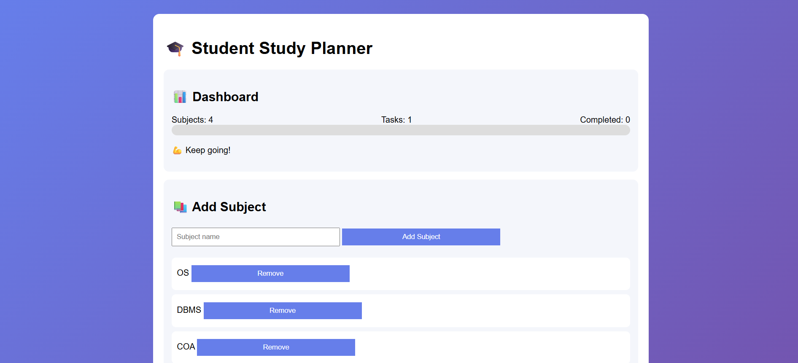
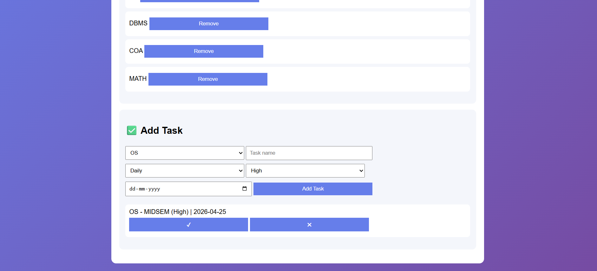

# Student Study Planner Web App 🌸

This is my first personal portfolio website.
I am a 3rd year CSE (AI/ML) student learning web development from scratch.

✨ Features

## 🛠️ Technologies Used
- HTML
- CSS
- JavaScript

## 📸 Screenshot

## 🌐 Live Demo
https://nehajaiz.github.io/Student-Study-Planner-Web-App/

## 📚 What I Learned
- Basic HTML structure
- CSS styling
- Hosting on GitHub

👩‍💻 Author
Neha Kumari

B.Tech CSE (AI & ML)

Passionate about Artificial Intelligence,
Machine Learning,
Data Analytics, 
and Full-Stack Development.

GitHub: https://github.com/nehajaiz

LinkedIn: https://www.linkedin.com/in/neha-kumari38/

⭐ Support
If you found this project useful, consider giving it a ⭐ on GitHub. 

It helps others discover the project and motivates further development.
